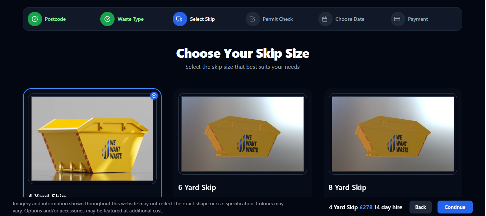
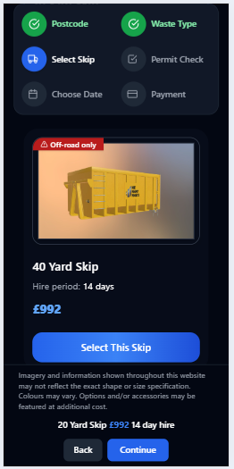

#  Skip Selection Component

This project is a responsive, interactive **Skip Selection UI** built using **React**, **Tailwind CSS**, and **Axios**. It allows users to view and select skip sizes based on their location and fits seamlessly into a multi-step booking flow.

---

## Getting Started

This project was bootstrapped with [Create React App](https://github.com/facebook/create-react-app).

### Available Scripts

In the project directory, you can run:
#### `npm i -f`
#### `npm start`

Runs the app in development mode.  
Open [http://localhost:3000](http://localhost:3000) to view it in the browser.

---

## Features

-  Multi-step **Progress Stepper**
-  **Skip data fetched** from an external API
-  **Responsive UI** using Tailwind CSS
-  **Interactive skip cards** with selection feedback
-  **Modular, reusable component architecture**
-  **Accessible and keyboard-navigable**
-  UI feedback for **loading and selection**

---

##  Approach

###  Component Architecture

The app is structured with focused, reusable components:

- **`Stepper.jsx`** – Displays the step progress bar; sticky on mobile view
- **`SkipCard.jsx`** – Renders each skip and handles selection logic
- **`BottomBar.jsx`** – Sticky footer showing selected skip and action buttons
- **`SkipSelection.jsx`** – Main container managing state and API fetching

###  Data Fetching

- Axios is used to fetch skips based on postcode/area.
- Loading and error states are handled with graceful fallbacks.

###  State Management

- `skips` – List of available skip options
- `loading` – Indicates data-fetching status
- `selectedSkipId` – Tracks the currently selected skip

###  User Interaction

- Users can click (or press Enter/Space) to select/deselect skips
- A sticky bottom summary appears once a skip is selected
- "Back" and "Continue" buttons manage navigation

---

##  UI/UX Design

Designed to be clean, responsive, and accessible, with special behavior:

- Stepper is **sticky on mobile view** only
- BottomBar appears **only when a skip is selected**
- Uses **Tailwind's utility classes** for rapid styling

---

##  Screenshots

###  Browser View UI

###  Skip Card View

###  Mobile View (Sticky Stepper)
